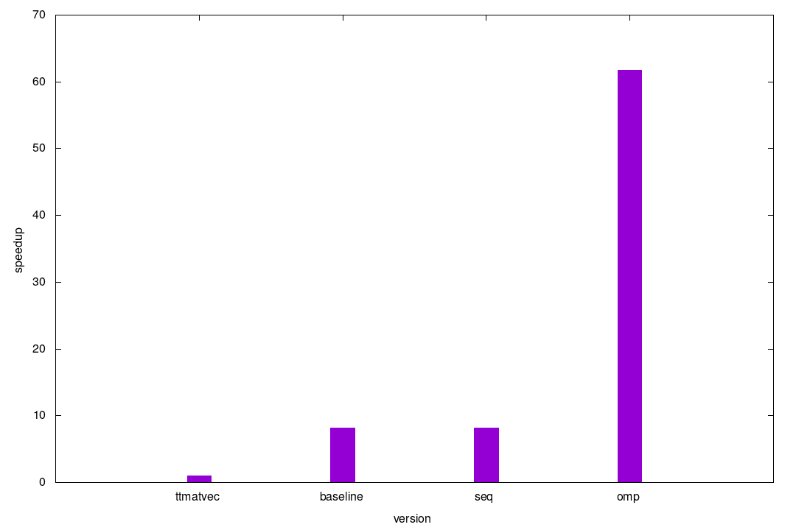

# matvev

Matrice vector product in tensor-train format

## Instructions

Compile project with `make`.
Run benchmarks with `make bench`.
Run test suite with `make test`.

Format code with `clang-format -i src/*.cpp include/*.h`.

### Usage

#### Creating a ttmat:
Here is an example for creating a 3-dimensional TT-matrix of sizes (10x15), (12x12), (14x8) and ranks (1, 5, 8, 1).

```
./build/create-ttmat -f ttmat.bin -d 3 -m 10,12,14 -n 15,12,8 -r 5,8

```

#### Creating a ttvec:
Here is an example for creating a 3-dimensional TT-vector of sizes (15, 12, 8) and ranks (1, 4, 2, 1).

```
./build/create-ttvec -f ttvec.bin -d 3 -m 15,12,8 -r 4,2
```

#### Running the skeleton code
After having craeted a TT-matrix and a TT-vector in a file (say "mata.bin" and "vecx.bin"), you can run the skeleton code that computes the matrix-vector multiplication and saves it in the file "vecy.bin" as follows
```
./build/ttmatvec -a mata.bin -x vecx.bin -y vecy.bin
```
Note that this around, the number of columns of the TT-matrix in each dimension (specified after -n above) must
correspond to number of rows of the corresponding dimension of the TT-vector to be multiplied with (specified after -m).

#### Comparing the resulting ttvec
Once your code creates the matvec result in a file (say "vecy.bin"), you need to compare it with the result of the
reference implementation (say "vecy-ref.bin"). You can realize this with the following command
```
./build/compare-ttvec -x vecy.bin -y vecy-ref.bin
```

## Results

*Processor:* Intel(R) Xeon(R) CPU E5-2670 v2 @ 2.50GHz
*Compiler:* gcc 4.8.5
